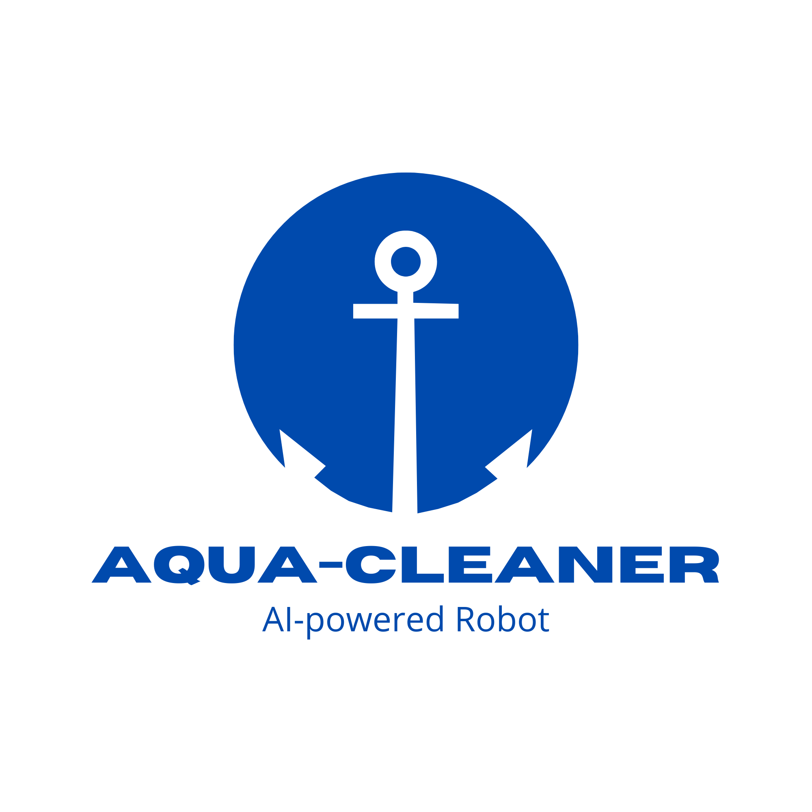
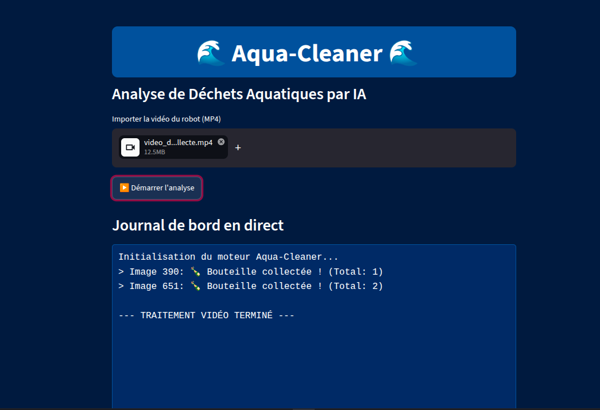
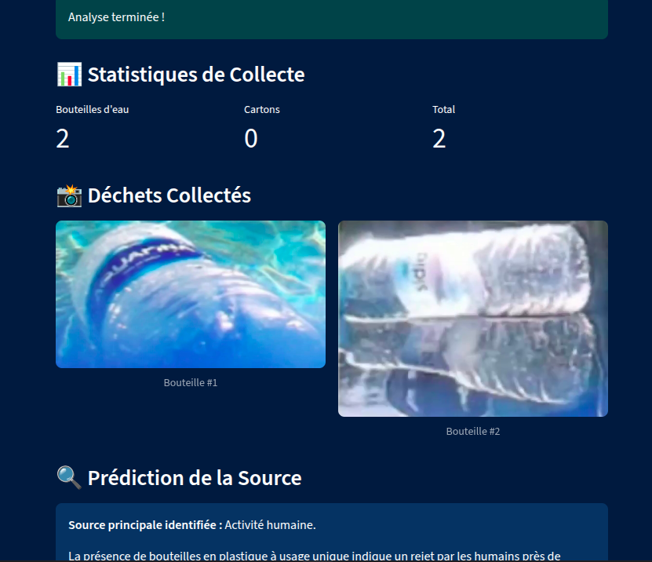
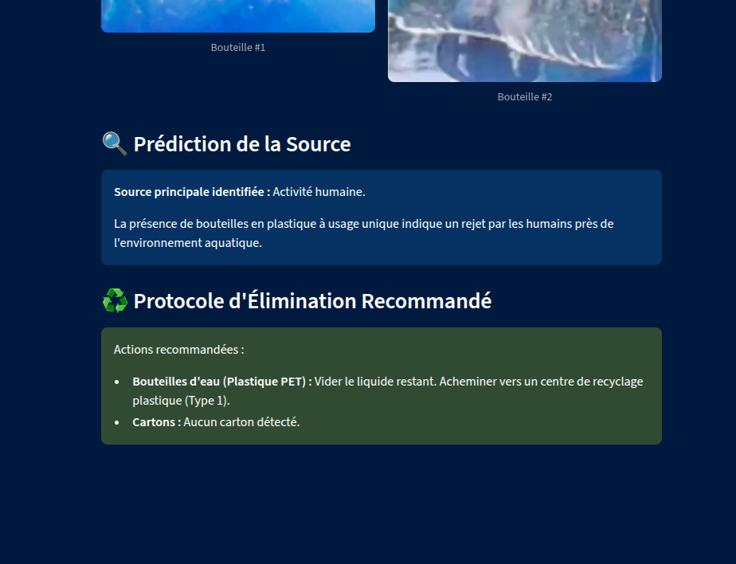
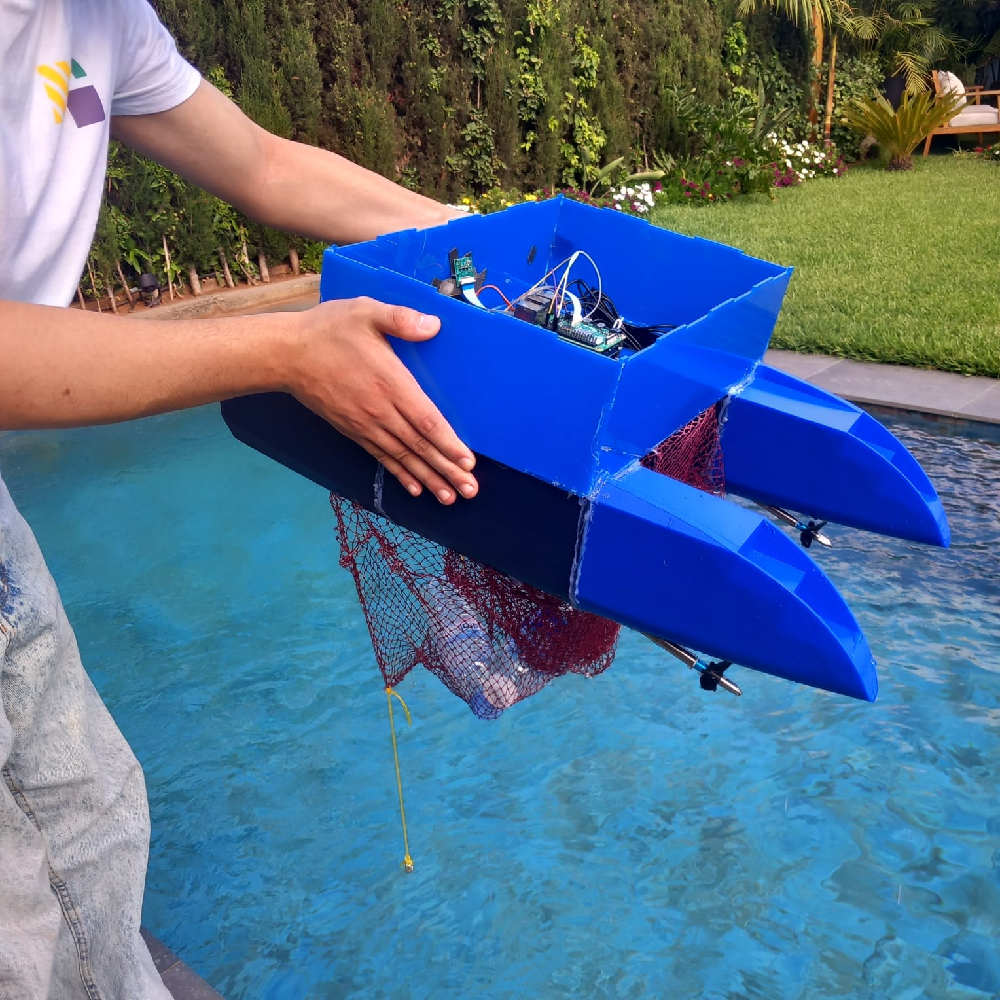

<a id="readme-top"></a>

<!-- PROJECT SHIELDS -->
[![Contributors][contributors-shield]][contributors-url]
[![Forks][forks-shield]][forks-url]
[![Stargazers][stars-shield]][stars-url]
[![Issues][issues-shield]][issues-url]
[![project_license][license-shield]][license-url]
[![LinkedIn][linkedin-shield]][linkedin-url]


<!-- PROJECT LOGO -->
<br />
<div align="center">
  <a href="https://github.com/meh6di/navigation_robot">
    
  </a>

<h3 align="center">Aqua-Cleaner</h3>

  <p align="center">
    Robot autonome catamaran pour la collecte des macro-déchets flottants dans les ports et marinas
    <br />
    <a href="./Rapport.pdf"><strong>Lire le rapport complet »</strong></a>
    <br />
    <br />
    <a href="#demo">Voir la démo</a>
    &middot;
    <a href="https://github.com/meh6di/navigation_robot/issues/new?labels=bug&template=bug-report---.md">Report Bug</a>
    &middot;
    <a href="https://github.com/meh6di/navigation_robot/issues/new?labels=enhancement&template=feature-request---.md">Request Feature</a>
  </p>
</div>


<!-- TABLE OF CONTENTS -->
<details>
  <summary>Table of Contents</summary>
  <ol>
    <li>
      <a href="#about-the-project">About The Project</a>
      <ul>
        <li><a href="#built-with">Built With</a></li>
      </ul>
    </li>
    <li><a href="#demo">Demo</a></li>
    <li><a href="#screenshots">Screenshots</a></li>
    <li>
      <a href="#getting-started">Getting Started</a>
      <ul>
        <li><a href="#prerequisites">Prerequisites</a></li>
        <li><a href="#installation">Installation</a></li>
      </ul>
    </li>
    <li><a href="#usage">Usage</a></li>
    <li><a href="#roadmap">Roadmap</a></li>
    <li><a href="#contributing">Contributing</a></li>
    <li><a href="#license">License</a></li>
    <li><a href="#contact">Contact</a></li>
    <li><a href="#acknowledgments">Acknowledgments</a></li>
  </ol>
</details>


<!-- ABOUT THE PROJECT -->
## About The Project

**Aqua-Cleaner** is an autonomous catamaran robot designed to collect floating macro-waste (bottles, cartons, plastics...) in ports and marinas. It was built as part of the **Learning by Doing** program at **École Centrale Casablanca**.

The system uses a Raspberry Pi 4 onboard to capture live video, which is streamed over TCP/IP to a remote PC running a custom-trained **YOLOv8 Nano** model for real-time waste detection (~32 FPS). Once a target is identified, a distance-based prioritization algorithm selects the closest piece of trash, and a **PID controller** computes a steering correction that is applied through **differential propulsion** (no rudder needed) to steer the robot toward it. Collected waste is scooped into a weighted net, and a companion web app analyzes the collected items, counts them, and estimates their total weight.

Full methodology, hardware choices, test results, and analysis are documented in the [project report](./Template_Rapport_PLBD_Latex_claude.pdf).

**Team (Groupe N°28):**
* EL ALLAOUI Mohamed El Mehdi — AI, detection & navigation
* CHAKIR Mohamed — Mechanical structure, hull & collection
* Chekaba Yassine
* HASSAR Nada — Project lead, coordination & integration
* VIANNEY Léandre — Electronics, power & propulsion

**Supervisor:** Mr. DAMIL Noureddine

<p align="right">(<a href="#readme-top">back to top</a>)</p>


### Built With

* 
* 
* 
* 
* 
* 

<p align="right">(<a href="#readme-top">back to top</a>)</p>


<!-- DEMO -->
## Demo

<!-- Add the demo video of the robot in action here, e.g. by uploading it to the repo (Issues/PRs support drag-and-drop video embeds) or linking to YouTube -->
https://github.com/user-attachments/assets/cecb5934-fbbf-4917-909e-da98aa274c7a

<p align="right">(<a href="#readme-top">back to top</a>)</p>


<!-- SCREENSHOTS -->
## Screenshots

**WasteVision web app** — analyzes collected waste, counts items, and estimates total weight:

<p align="center">
  
</p>

<p align="center">
  
</p>

<p align="center">
  
</p>

**Robot after a collection run:**

<p align="center">
  
</p>

<p align="right">(<a href="#readme-top">back to top</a>)</p>


<!-- GETTING STARTED -->
## Getting Started

This repository contains the software stack of the robot: the onboard client running on the Raspberry Pi, the detection server running on the remote PC, and the web app used to analyze collected waste.

### Prerequisites

* Python 3.9+
* A Raspberry Pi 4 (client side) with `picamera2` and `pigpio` installed
* A remote PC with a GPU recommended for smoother YOLOv8 inference
* `pip`
  ```sh
  python -m pip install --upgrade pip
  ```

### Installation

1. Clone the repo
   ```sh
   git clone https://github.com/meh6di/navigation_robot.git
   cd navigation_robot
   ```
2. Install the Python dependencies
   ```sh
   pip install -r requirements.txt
   ```
3. Make sure the trained weights are present
   ```
   bottle_weights.pt
   bottle_weights_openvino_model/
   ```
4. On the Raspberry Pi, set the remote PC's IP address in `client.py`
   ```python
   PC_IP = "192.168.1.100"
   PC_PORT = 9999
   ```
5. Start `pigpiod` on the Raspberry Pi (required for motor control)
   ```sh
   sudo pigpiod
   ```

<p align="right">(<a href="#readme-top">back to top</a>)</p>


<!-- USAGE EXAMPLES -->
## Usage

**1. On the remote PC** — start the detection server (runs the YOLOv8 model and computes the steering error):
```sh
python server.py
```

**2. On the Raspberry Pi** — start the onboard client (captures video, sends frames, drives the motors):
```sh
python client.py
```

**3. Analyze a collection run** — start the web app to process a folder of images captured during collection and get a waste count / weight estimate:
```sh
python app.py
```
Collected/processed trash images can be organized under `collected_trash/`.

_For the full explanation of the detection, prioritization, and PID-based navigation algorithms, see [section 4.6 of the report](./Rapport.pdf)._

<p align="right">(<a href="#readme-top">back to top</a>)</p>


<!-- ROADMAP -->
## Roadmap

- [ ] Reduce Wi-Fi/TCP-IP latency between the Raspberry Pi and the remote PC
- [ ] Explore low-latency communication modules (e.g. 5G) to remove the dependency on a local network
- [ ] Expand the training dataset to cover more waste types (beyond bottles/cartons)
- [ ] Improve weight estimation with a broader reference dataset (multiple bottle sizes/materials)
- [ ] Fully validate the waste-source prediction feature (urban / river / industrial) with a larger dataset
- [ ] Onboard inference optimization to reduce reliance on the remote PC

See the [open issues](https://github.com/meh6di/navigation_robot/issues) for a full list of proposed features and known issues.

<p align="right">(<a href="#readme-top">back to top</a>)</p>


<!-- CONTRIBUTING -->
## Contributing

This started as an academic project (Learning by Doing, École Centrale Casablanca), but contributions are welcome!

1. Fork the Project
2. Create your Feature Branch (`git checkout -b feature/AmazingFeature`)
3. Commit your Changes (`git commit -m 'Add some AmazingFeature'`)
4. Push to the Branch (`git push origin feature/AmazingFeature`)
5. Open a Pull Request

<p align="right">(<a href="#readme-top">back to top</a>)</p>


<!-- LICENSE -->
## License

Distributed under the license in `LICENSE`. See `LICENSE` for more information.

<p align="right">(<a href="#readme-top">back to top</a>)</p>


<!-- CONTACT -->
## Contact


**Mohamed El Mehdi EL ALLAOUI**  
* **LinkedIn:** [Mehdi EL ALLAOUI](https://www.linkedin.com/in/mehdi-el-allaoui-24b6b5291/)  
* **Email:** [mohamedelmehdi.elallaoui@centrale-casablanca.ma](mailto:mohamedelmehdi.elallaoui@centrale-casablanca.ma)

<p align="right">(<a href="#readme-top">back to top</a>)</p>


<!-- ACKNOWLEDGMENTS -->
## Acknowledgments

* Mr. DAMIL Noureddine — Project supervisor
* École Centrale Casablanca — Learning by Doing program
* The school's FabLab team, for access to fabrication equipment
* [ORCA-Uboat FloW-Dataset](https://github.com/ORCA-Uboat/FloW-Dataset) — floating waste dataset used to train YOLOv8 Nano
* [IADYS Jellyfishbot](https://www.iadys.com/jellyfishbot/) and [Seabin Project](https://seabin.io/home) — reference solutions studied during the state-of-the-art phase

<p align="right">(<a href="#readme-top">back to top</a>)</p>


<!-- MARKDOWN LINKS & IMAGES -->
[contributors-shield]: https://img.shields.io/github/contributors/meh6di/navigation_robot.svg?style=for-the-badge
[contributors-url]: https://github.com/meh6di/navigation_robot/graphs/contributors
[forks-shield]: https://img.shields.io/github/forks/meh6di/navigation_robot.svg?style=for-the-badge
[forks-url]: https://github.com/meh6di/navigation_robot/network/members
[stars-shield]: https://img.shields.io/github/stars/meh6di/navigation_robot.svg?style=for-the-badge
[stars-url]: https://github.com/meh6di/navigation_robot/stargazers
[issues-shield]: https://img.shields.io/github/issues/meh6di/navigation_robot.svg?style=for-the-badge
[issues-url]: https://github.com/meh6di/navigation_robot/issues
[license-shield]: https://img.shields.io/github/license/meh6di/navigation_robot.svg?style=for-the-badge
[license-url]: https://github.com/meh6di/navigation_robot/blob/master/LICENSE
[linkedin-shield]: https://img.shields.io/badge/-LinkedIn-black.svg?style=for-the-badge&logo=linkedin&colorB=555
[linkedin-url]: https://linkedin.com/in/linkedin_username


